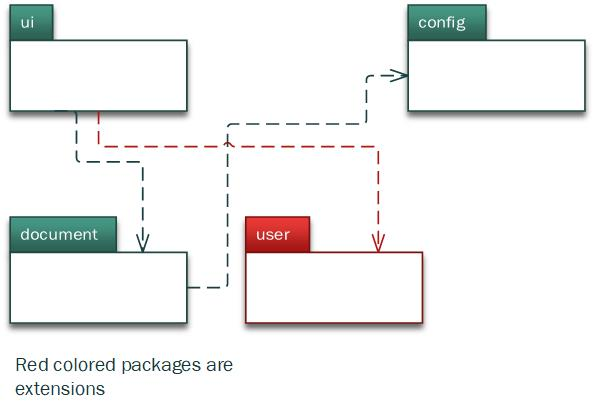
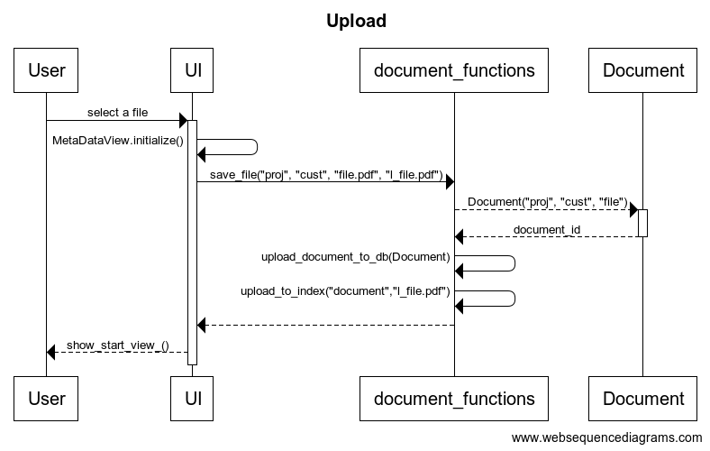
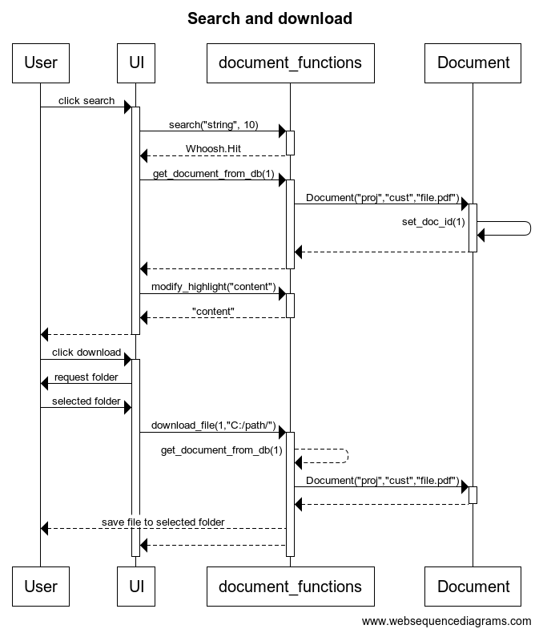

# Software architecture

## Layer structure

The application conforms to two-layered architectural design:

The first layer is the user interface layer isolated from the software logic. The second layer contains the software logical components. Each package in the layer conforms to the logical entity of the software such as document and user and the necessary functions related to the entity (design principle learned on the course *Aineopintojen harjoitustyö: Tietokantasovellus*).

Package _ui_ comprises of the graphical user interface logic. Package _document_ contains the data access objects including storage and search functions for document class. If more class objects are added (such as _user_ class which is considered an extension in application requirements) those are added as separate packages. 

Additionaly, package _config_ contains the application configuration files and _utilities_ contains utility modules with utility functions.

## Software logic

The logical data structure of the software is comprised of the [Document](https://github.com/roopekole/ohte-harjoitustyo/blob/master/app/src/document/document.py) class. The Document class is intertwined with the [document functions](https://github.com/roopekole/ohte-harjoitustyo/blob/master/app/src/document/document_functions.py) module which contains the storage, indexing, querying, uploading and downloading functions for document object.

### Document entity

The logical features of the base functionalities are contained in the _document_ package which comprises of document entity related logic. The [document functions](https://github.com/roopekole/ohte-harjoitustyo/blob/master/app/src/document/document_functions.py) module provides user interface with the necessary functions such as:
- `save_file(project, customer, file, long_file_name)` to upload the file and the related metadata
- `get_all_documents_from_db` to browse all stored data
- `search(search_string, limit)` to perform the full text search
- `download_file(doc_id, directory)` to download the desired file to the selected directory on the user's harddrive

### Other entities

The application could be easily extended for instance with the user class (see package structure diagram) to allow maintenance via GUI. The user class is considered an extension to the lab project scope.

The application could also be extended to link customers (described as a separate module in above package diagram) and projects, which are now free text entries, as object entities to the document. However, this type of data structural logic is considered uncharacteristic for the scope and hence not implemented.

## Graphical user interface

Graphical user interface contains four different views with sub-view classes:
 * Start view - view where user lands when initiating the application
 * Search view - view which allows for full text index search of the document contents
 * Browse view - view which allows for browsing the stored documents
 * Upload view - view which allows for uploading the documents

Each view has been implemented as it's own class within the ui-module. Search and Upload view contain sub-classes which are displayed based on user's actions.

User interface has been completely isolated from the software logic and it utilizes only the essential methods in the document functions module (along with utility functions in utilities module).

## Storage, upload and download

Storage, upload and download are main features of the application. Application stores a physical document file and its metadata along with the indexed content (see Document and indexing) uploaded by the user. Any other user is later allowed to download that file on his/her harddrive.

The storage related server processes are initiated by user request. The metadata of the document is stored first to the SQLite database, subsequently the file is stored with the db id to the physical file storage, and the file contents are parsed and indexed to Whoosh index storage files.

### Document and indexing files

The physical file storage and index file storage are defined in the application configuration (see [.env](https://github.com/roopekole/ohte-harjoitustyo/blob/master/app/.env) files). Both directories are initialized during the application build.

The physical file storage stores the file binary. The files are titled with the database id that corresponds to the file. If user downloads the file, the file is stored to the user selected folder with the original name.

The indexing files are standard Whoosh library index files. They index the content of the document and also store the document for displaying the highlighted hits. Indexing (consequential querying) is configurable, however, there are hardcoded references in the source code to all the Whoosh [schema](https://github.com/roopekole/ohte-harjoitustyo/blob/master/app/src/config/whoosh_config.py#L13) attributes and hence only additional attributes should be considered.  

## Major features

Two of the main features are depicted below as sequence diagrams. Note that downloading from the _browse view_ is logically analogous to download from _search view_ and hence separate diagram has not been drawn.

**Upload document with the metadata**

The below sequence diagram describes the logical events after user has clicked "Select a file" button and selected the file to be uploaded on the upload view of the user interface:

Assuming that the file type is allowed (.pdf), the user interface constructs and initializes the view defined by the [MetaDataInputs](https://github.com/roopekole/ohte-harjoitustyo/blob/master/app/src/ui/upload_view.py#L7) class. After user has entered the metadata for the document, the _UI_ class calls the [save_file](https://github.com/roopekole/ohte-harjoitustyo/blob/master/app/src/document/document_functions.py#L117) function of the _document_functions_ module. Then, a [document object](https://github.com/roopekole/ohte-harjoitustyo/blob/master/app/src/document/document.py#L2) is constructed and that object is first stored to metadata database with [upload_document_to_db](https://github.com/roopekole/ohte-harjoitustyo/blob/master/app/src/document/document.py#L2) function of the _document_functions_ module. Finally the document is indexed to Whoosh index with [upload_to_index](https://github.com/roopekole/ohte-harjoitustyo/blob/master/app/src/document/document_functions.py#L99) function of the same module. Finally user is returned to start view _show_start_view_ function of the _UI_ class. (Note! Whoosh indexing related sequencing is not displayed in the diagram).

**Search and download**

The below sequence diagram describes the logical events after user has entered some search string (e.g. "string") on the search view of the user interface which yields a hit in the indexed text content:

Clicking search on the _search_view_ of the user interface, the _UI_ class calls the [search](https://github.com/roopekole/ohte-harjoitustyo/blob/master/app/src/document/document_functions.py#L25) function of the _document_functions_ module. The search returns a _Whoosh_ query _Hit object_ for _UI_. After receiving the hit object, for each hit, _UI_ calls the [get_document_from_db](https://github.com/roopekole/ohte-harjoitustyo/blob/master/app/src/document/document_functions.py#L62) function to get the related metadata for the indexed content. This function constructs a _Document_ object for each hit and metadata combination and returns this class object to _UI_. _UI_ then calls the [modify_highlight](https://github.com/roopekole/ohte-harjoitustyo/blob/master/app/src/document/document_functions.py#L11) of _document_functions_ module to visually highlight the search string hits with the content. Properly highlighted content is returned for _UI_. 

Then user can download the related document from the file storage to his / her own harddrive by clicking download button. Download button pops up a dialog requesting a folder to transfer the selected file. After the folder has been selected _UI_ calls the [download_file](https://github.com/roopekole/ohte-harjoitustyo/blob/master/app/src/document/document_functions.py#L141) function of the _document_functions_ module with the selected folder and database id as parameters. The file is stored with the original name by constructing the _Document_ class object by querying the metadata from the database with _get_document_from_db_ with _doc_id_ as parameter. Finally the file is written to the user's harddrive. 

## Known issues

### User interface
User interface contains duplicated code in the footer. Footer should be generated from its own module and changed dynamically in each of the views. Repeating the footer now results in some Pylint warnings and additional arguments in user interface classes.

### Document upload
Document upload failure error message shown to user is not explicit. Moreover, metadata entries are not required and may be left blank without any errors.

### Document browse
Document browsing view is somewhat messy as the columns are not fixed and instead the column lenght varies with field lenght.

Pagination is missing and today after approximately 20 documents the user interface starts losing elements.

### Document search
Search only applies to the document content - not metadata. Search listing becomes somewhat messy since the list columns vary with data. Large amount of search results limits the usability.