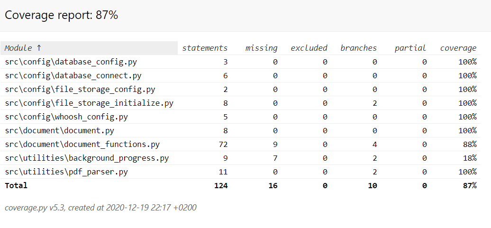

# Test documentation

The application has been tested with automated unit and integration tests. Test automation is based on *pytest* library. On top of the automated tests, the application has been tested with manual system testing.

## Unit and integration testing

### Application logic

Application logic defined in the [Document](https://github.com/roopekole/ohte-harjoitustyo/blob/master/app/src/document/document.py) and the linked [document functions](https://github.com/roopekole/ohte-harjoitustyo/blob/master/app/src/document/document_functions.py) module are tested respectively with modules
- [document_test](https://github.com/roopekole/ohte-harjoitustyo/blob/master/app/src/tests/document_test.py)
- [document_functions_test)(https://github.com/roopekole/ohte-harjoitustyo/blob/master/app/src/tests/document_functions_test.py)

Automated tests utilize testing specific environment variables which again are tested by [test_env_paths](https://github.com/roopekole/ohte-harjoitustyo/blob/master/app/src/tests/test_env_paths.py) unit test module. These variables allow using a test database and index file replicas for database and index testing. Moreover, configurations and utilities are also covered by test automation. Graphical user interface related implementation has been outscoped from the testing.

**Database related test**

The automated tests utilize a test SQLite database defined by the aforementioned test specific environment variables. The test database is included in the repository and can be directly utilized. Data queries and inserts are tested against the test database.

**Indexing and file storage related tests**

The automated tests utilize replicated Whoosh index files which are included in the source data contained in the repository and hence can be directly utilized. The environment variables control that the replicas are used and all indexing tests are carried against the fake indices.

The source data contains also testable document files and file storage pointed by environment variables. Upload is tested against these testable document files and download functions  are tested with the file in the test file storage.

**Configurations and utilities related **

The application comes with a set of configuration files and utility functions which are tested by unit test modules:
- [config test](https://github.com/roopekole/ohte-harjoitustyo/blob/master/app/src/tests/config_test.py)
- [utilities_test](https://github.com/roopekole/ohte-harjoitustyo/blob/master/app/src/tests/utilities_test.py)

### Test coverage

The branching coverage of the application tests is 87%.

Uncovered application logic related functions are 
- Integrated function that stores the uploaded document and the metadata to index, database and file storage
- Checking the allowed file type

## System testing

The system testing of the application has been done manually.

### Installation and configuration

Applicatoin has been downloaded from the repository and it has been installed and executed according to the [user manual](./user_manual.md). The usage of the application during the system followed also the steps in the user manual. Testing has been performed with Windows 10 and Linux Ubuntu operating systems. Different configurations of the [.env](https://github.com/roopekole/ohte-harjoitustyo/tree/master/app) environment variables have also been tested.

### Functional testing and known issues

The system test has covered all the requirements contained in the [Application requirements](./application_requirements.md) documentation. The application has been exposed to a wide range of commands and entries to reveal flaws in the system. Found issues have been either addressed in the application development or listed as [known issues](https://github.com/roopekole/ohte-harjoitustyo/blob/master/app/documentation/software_architecture.md#known-issues) in [Sofware architecture](./software_architecture.md) documentation.
