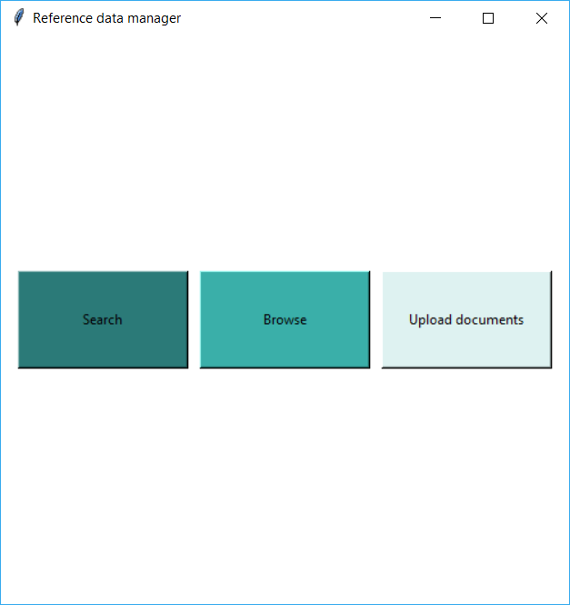
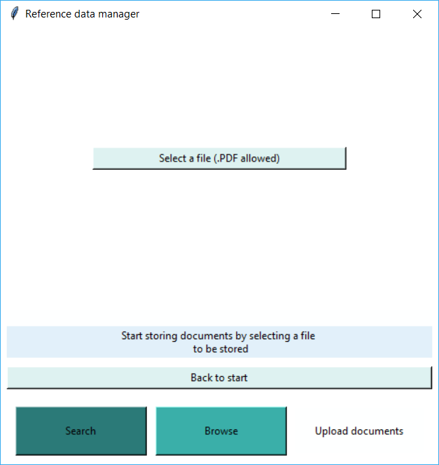
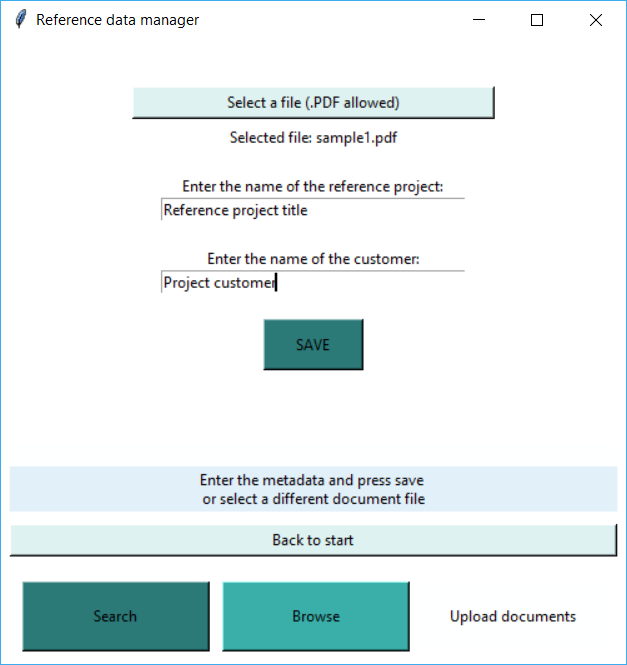
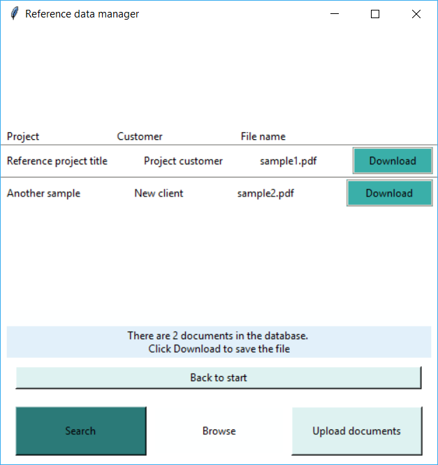
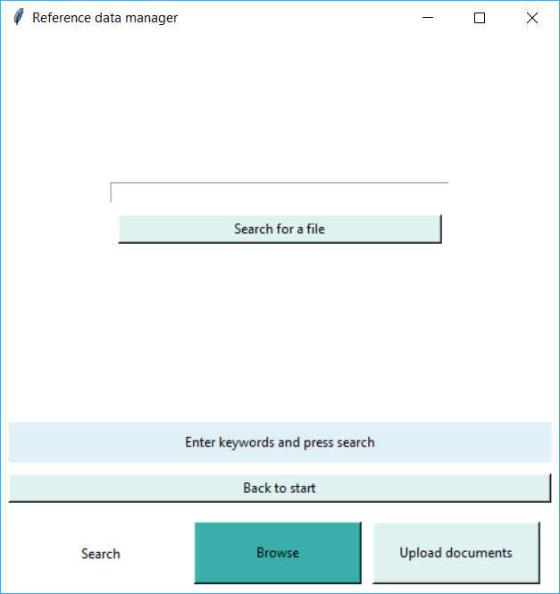
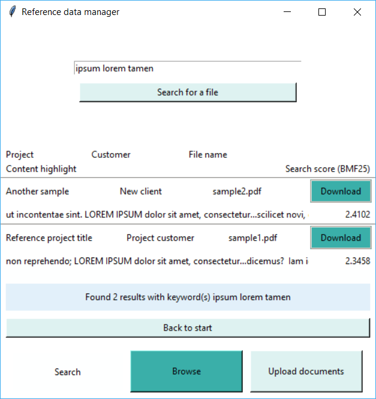

# User manual

Download the source code of the latest [release](https://github.com/roopekole/ohte-harjoitustyo/releases/) by selecting expanding _Assets_ and clicking _Source code_ (.zip or tar.gz).

## Configurations

You may change the database filename by altering DATABASE_FILENAME variable in config/database_config.py file. Database file is created created to the *data* directory during the build.
```
DATABASE_FILENAME=database.sqlite
```
(Whoosh indices are automatically stored to directory *indexfiles* and physical files are automatically stored to directory *file_storage*.

## Running the application

Before running the application, depedency installation is required:

```bash
python3 -m pipenv install
```

Application needs to be initiated by:

```bash
python3 -m pipenv run build
```

Application can now be started by:

```
python3 -m pipenv run start
```

## Landing view

Application enters to the start view:



Start view allows to either search or browse stored reference documents or to upload a new document.

## Uploading a reference document file

Upload view allows user to start uploading documents. User may also switch back to start or to browse or search view.



Pressing "Select a file" button user is asked to select a file for upload. After file has been selected the application asks user to enter project and customer metadata pertaining to the document:



By pressing save the file is stored with the metadata and it becomes searchable. User is returned to the start view after the upload process has completed.

(Sample PDF documents may be used to try the upload: [https://github.com/roopekole/ohte-harjoitustyo/tree/master/app/samples
](https://github.com/roopekole/ohte-harjoitustyo/tree/master/app/samples))

## Browsing the documents

All stored documents can be browsed through the browse view:



Browse view displays the project, customer and original file name information for the user.

Browse view allows user to download any file to his / her computer. Pressing download button asks user to specify the selected target directory and saves the file with the original file name.

## Searching the documents

Stored documents can be searched through search view



User may enter keyword(s) to search the contents of the stored documents for hits. 



If hits are found, the search results are listed. Listing displays the project, customer and the original file name for the user. 

Search result list also displays the snippet of the keyword hit. Results are sorted accoring to the relevance score and the scoring is also displayed.

Search view, analogous to the browse view, allows user to download the file to his / her harddrive.

